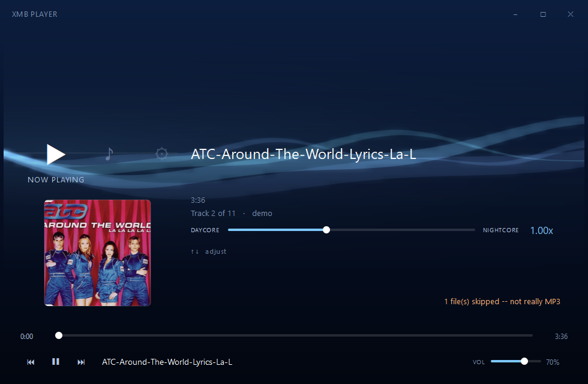
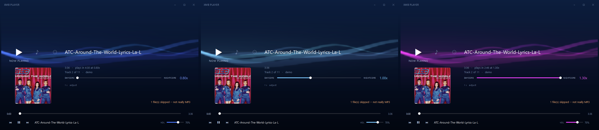
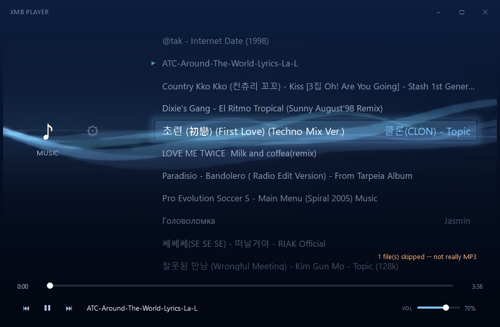
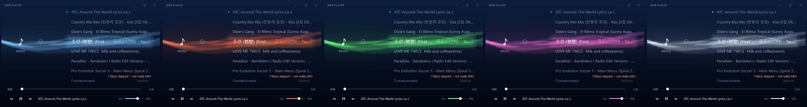

# XMB Player

A desktop MP3 player with a PlayStation 3 XMB skin. Point it at a folder, browse
your music, and drag one slider to turn any track into nightcore (faster, higher)
or daycore (slower, lower) while it's playing.

https://github.com/user-attachments/assets/2c7f0e35-23ff-4956-8acb-5d21d80266a2

[](https://github.com/BadrAlDhaibani/mp3-player/actions/workflows/ci.yml)

Windows · Python 3.13 · PySide6 · numpy · sounddevice · soundfile

---

## Why I built this

The PS3 dashboard is still the best-looking menu I've ever used, and I'd wanted
to rebuild it for a while. [Replace this with what actually got you started —
the XMB itself? nightcore edits on YouTube? wanting to see if you could?]

I also wanted an audio project where I owned the whole path instead of calling
someone else's `play()` and hoping. [What you wanted to prove to yourself here.]

The part I didn't see coming was [the thing that turned out to be hardest —
worth naming one, it's the most interesting sentence on this page].

---

## What it does

- **Nightcore and daycore, live.** Drag the slider and the pitch moves with the
  speed, in the track you're already hearing. `0.80x` is daycore, `1.30x` is
  nightcore. Nothing is pre-rendered and nothing is pitch-corrected — speeding
  up is *supposed* to make it squeakier.
- **The interface reads out the speed.** Deep blue at daycore, violet at
  nightcore. The background wave, the selection, every slider and every number
  shift together as you drag, so you can see the effect from any screen.
- **It tells you the real runtime.** `3:36 · plays in 2:46 at 1.30x`, updating
  as you move the slider.
- **Five colour themes.** Settings ▸ Theme, then `←` `→` to flip through them
  live. Remembered next launch, along with your folder, volume and speed.
- **Reads your tags.** Title, artist, album and embedded cover art. Untagged
  files just show their filename.

### Screens





*The same screen at daycore, normal and nightcore. Everything follows the slider.*





*XMB Blue, Ember, Aurora, Vapor, Mono.*

---

## Download

Grab the latest `XMB-Player-<version>-windows.zip` from
[**Releases**](https://github.com/BadrAlDhaibani/mp3-player/releases), unzip it
anywhere, and run `XMB Player.exe`. No installer. Keep the folder together — the
exe needs the files next to it.

It writes one folder, `%APPDATA%/XMBPlayer`, holding your settings and a small
log. Delete that and the unzipped folder and it's gone.

**You'll get a SmartScreen warning the first time.** Click *More info*, then
*Run anyway*. It shows up for any exe without a code-signing certificate, and
those cost a few hundred a year, which I'm not spending on this. If you'd rather
not, [run it from source](#running-from-source) instead — it's the same app.

---

## Controls

| | |
|---|---|
| `←` `→` | move between Now Playing · Music · Settings |
| `↑` `↓` | move down a list — or drive the speed slider on Now Playing |
| `Enter` | play the selected track, or open the selected setting |
| `Enter` on **Theme** | step into the row, then `←` `→` to browse, `Enter` or `Esc` to leave |
| `Backspace` | back a category |
| `Space` | play / pause |
| `Ctrl` + `←` `→` | previous / next track |
| `Shift` + `←` `→` | seek 5 seconds |
| `Home` `End` `PgUp` `PgDn` | jump around a list |
| `F11` | fullscreen |

The mouse works too: click a row to select it, click again to play, click a
category to switch, drag or scroll the speed slider.

First launch opens on **Settings ▸ Music folder**, since there's nothing to play
yet. It reads the `.mp3` files sitting directly in that folder, top level only.

---

## Running from source

```bash
python -m venv venv
venv/Scripts/python.exe -m pip install -r requirements.txt

run.bat                                    # keeps a console open
venv/Scripts/python.exe -m mp3player.app   # same thing, directly
```

There's no build step — both run the live source. For a desktop shortcut with no
console window:

```bash
powershell -ExecutionPolicy Bypass -File tools/make_shortcut.ps1
```

To build the standalone exe: `venv/Scripts/python.exe tools/build_exe.py`. It
draws the icon, stamps the version, builds, then launches what it built and
closes it again to check nothing's missing.
[`docs/RELEASING.md`](docs/RELEASING.md) has the full checklist.

### Checks

```bash
venv/Scripts/python.exe -m ruff check .           # lint
venv/Scripts/python.exe -m mypy                   # types
venv/Scripts/python.exe -m pytest                 # core logic, no display needed
venv/Scripts/python.exe tools/shell_harness.py    # the real widgets, offscreen
```

The first three are what CI runs. The harness is a local step because it opens a
real audio stream and CI runners don't have a sound card, so the badge covers the
core rather than the interface.

[`CLAUDE.md`](CLAUDE.md) is my working notebook for this project: every decision
with the reason behind it, the patterns worth reusing, and the measurements they
came from. It's long, but it's where the actual thinking is.

---

## How it works

The pitch shift is the same trick as playing a record faster. There's one
always-on output stream, and the music is read out of memory at a fractional
position:

```python
ratio = speed * (file_sr / stream_sr)
idx   = pos + np.arange(frames) * ratio
i0    = idx.astype(np.int64)
frac  = (idx - i0)[:, None]
out   = samples[i0] * (1 - frac) + samples[i0 + 1] * frac
pos  += frames * ratio
```

`pos` is a float that advances continuously, so `speed` can be reassigned at any
moment and the audio follows without a gap. That's the whole feature.

The rest is keeping it quiet. Every gain change — play, pause, seek, track
change, volume — ramps over about 10 ms instead of jumping, because a gain that
jumps puts a vertical edge in the waveform, and that edge is an audible click.

---

## Known limits

- **Some `.mp3` files aren't.** Around 8% of my library is actually MP4/AAC with
  the wrong extension, usually YouTube downloads. Those get sniffed by their
  magic bytes and skipped, and the app tells you how many rather than letting
  them silently disappear.
- **Speeding up aliases.** There's no anti-alias filter, so content above about
  17 kHz folds back at nightcore speeds. Every nightcore edit online does this.
- **Windows only.** It might work elsewhere, but I've never run it anywhere else
  and every measurement in the project is a Windows one.

---

## Licence

**GPL-2.0-or-later** — full text in [`LICENSE`](LICENSE). It's GPL because
[mutagen](https://mutagen.readthedocs.io/), which reads the ID3 tags, is.
Everything else it depends on is listed in
[`THIRD_PARTY_NOTICES.md`](THIRD_PARTY_NOTICES.md).

No Sony assets are used. The XMB look is rebuilt from scratch in Qt, and the UI
sounds are generated with numpy at startup rather than shipped as files.
